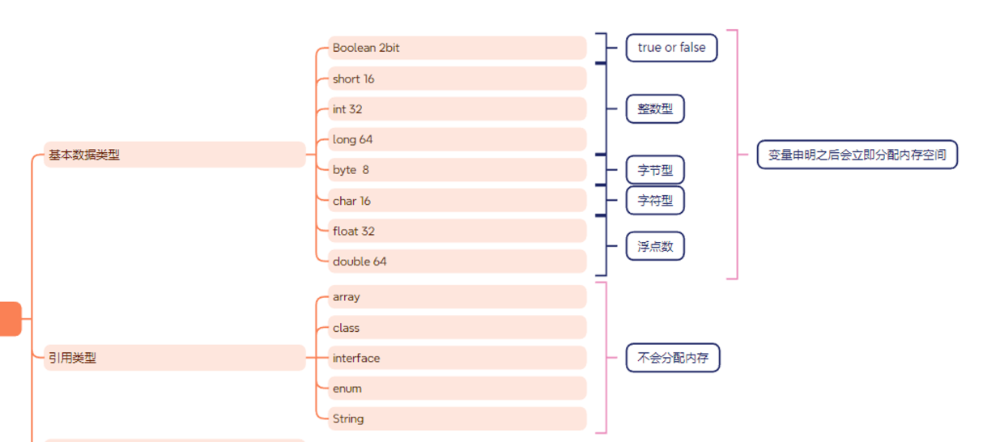
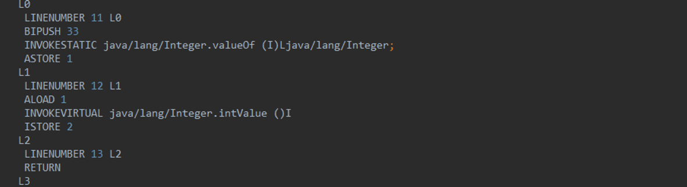
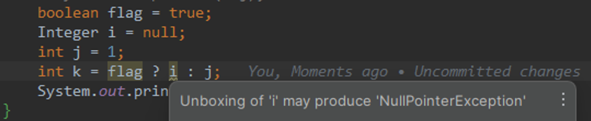
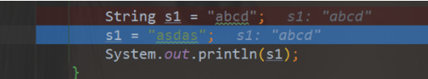
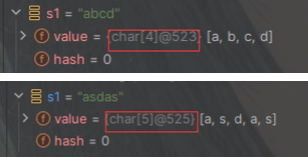
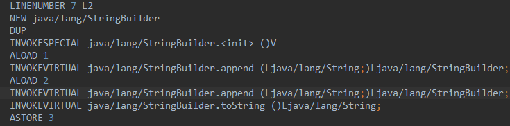

# 01 basic

## 数据类型



### 基本数据类型

| 基本类型 | 位数 | 字节 | 默认值  | 取值范围                                   |
| -------- | ---- | ---- | ------- | ------------------------------------------ |
| byte     | 8    | 1    | 0       | -128 ~ 127                                 |
| short    | 16   | 2    | 0       | -32768 ~ 32767                             |
| int      | 32   | 4    | 0       | -2147483648 ~ 2147483647                   |
| long     | 64   | 8    | 0L      | -9223372036854775808 ~ 9223372036854775807 |
| char     | 16   | 2    | 'u0000' | 0 ~ 65535                                  |
| float    | 32   | 4    | 0f      | 1.4E-45 ~ 3.4028235E38                     |
| double   | 64   | 8    | 0d      | 4.9E-324 ~ 1.7976931348623157E308          |
| boolean  | 1    |      | false   | true、false                                |

### 自动转换
- 由小数据转换为大数据的时候会发生自动转换
(byte，short，char) < int < long < float < double
- 整型类型和浮点型进行计算后，结果会转为浮点类型
```java
long x = 30;
float y = 14.3f;
System.out.println("x/y = " + x/y);
x/y = 1.9607843
```
> “大”与“小”，并不是指占用字节的多少，而是指表示值的范围的大小
> 可见 long 虽然精度大于 float 类型，但是结果为浮点数类型
- 转换前后的数据类型要兼容
由于 boolean 类型只能存放 true 或 false，这与整数或字符是不兼容的，因此不可以做类型转换。
### 强制转换
强制转换使用括号 () 。
引用类型也可以使用强制转换
```JAVA
float f = 25.5f;
int x = (int)f;
System.out.println("x = " + x);
```

### 包装类

基本类型都有对应的包装类型，基本类型与其对应的包装类型之间的赋值使用自动装箱与拆箱完成。

```java
Integer x = 2;     // 装箱
int y = x;         // 拆箱
```

- new Integer(123) 每次都会新建一个对象
- Integer.valueOf(123) 会使用缓存池中的对象，多次调用会取得同一个对象的引用。

```java
Integer a= new Integer(123);
Integer b = new Integer(123);
System.out.println(a == b);    // false
Integer c = Integer.valueOf(123);
Integer d = Integer.valueOf(123);
System.out.println(c == d);   // true
```

编译器会**在缓冲池范围内的基本类型**自动装箱过程调用 valueOf() 方法，因此多个 Integer 实例使用自动装箱来创建并且值相同，那么就会引用相同的对象

```java
    public static Integer valueOf(int i) {
        if (i >= IntegerCache.low && i <= IntegerCache.high)
            return IntegerCache.cache[i + (-IntegerCache.low)];
        return new Integer(i);
    }

    private static class IntegerCache {
        static final int low = -128;
        static final int high;
        static final Integer cache[];

        static {
            // high value may be configured by property
            int h = 127;
            String integerCacheHighPropValue =
                sun.misc.VM.getSavedProperty("java.lang.Integer.IntegerCache.high");
            if (integerCacheHighPropValue != null) {
                try {
                    int i = parseInt(integerCacheHighPropValue);
                    i = Math.max(i, 127);
                    // Maximum array size is Integer.MAX_VALUE
                    h = Math.min(i, Integer.MAX_VALUE - (-low) -1);
                } catch( NumberFormatException nfe) {
                    // If the property cannot be parsed into an int, ignore it.
                }
            }
            high = h;

            cache = new Integer[(high - low) + 1];
            int j = low;
            for(int k = 0; k < cache.length; k++)
                cache[k] = new Integer(j++);

            // range [-128, 127] must be interned (JLS7 5.1.7)
            assert IntegerCache.high >= 127;
        }

        private IntegerCache() {}
    }
```

基本类型对应的缓冲池如下:

- boolean values true and false
- all byte values
- short values between -128 and 127
- int values between -128 and 127
- char in the range \u0000 to \u007F

### 基本数据和包装类

- 基本类型占用的空间更小
- 基本类型不赋值有默认值，而包装类型不赋值默认为null
- 基本类型存储在栈中，包装类型存储在堆中
    - Java中的基本类型（如**`int`**、**`float`**、**`double`**、**`boolean`**等）通常存储在栈内存中。这是因为基本类型的值直接存储在使用它们的方法的栈帧中。基本类型的值是直接按值传递的，它们的生命周期通常随着方法的调用而开始，随着方法的返回而结束
    - 另一方面，包装类型（如**`Integer`**、**`Float`**、**`Double`**、**`Boolean`**等）是基本类型的对象表示形式，它们用于Java集合框架中，以及在需要对象而非基本类型的其他情况下。由于包装类型是对象，它们的实例存储在堆内存中。当创建一个包装类型的实例时（例如通过**`new Integer(5)`**），就会在堆内存中分配空间来存储这个对象，而对象的引用则可以存储在栈内存中（如果它是一个局部变量）。
- 无论是基本类型还是引用类型的成员变量，如果它们是对象的非**`static`**成员，那么这些成员变量的数据都存储在堆内存中的。
    - static变量是存储在方法区的

### 自动装箱和拆箱
基本数据类型与包装类的转换被称为装箱和拆箱。
装箱（boxing）是将值类型转换为引用类型。例如：int 转 Integer。
拆箱（unboxing）是将引用类型转换为值类型。例如：Integer 转 int
```java
Integer c1 = 33;//装箱
        int c2 = c1;//拆箱
```



从字节码中，我们发现装箱其实就是调用了 包装类的`valueOf()`方法，拆箱其实就是调用了 `xxxValue()`方法。

### scene

- **场景一、将基本数据类型放入集合类**

Java中的集合类只能接收对象类型

```java
List<Integer> li = new ArrayList<>();
 for (int i = 1; i < 50; i ++){  
    li.add(i); 
    }
    
 反编译
         List<Integer> li = new ArrayList<>();
        for (int i = 1; i < 50; i++) {
            li.add(Integer.valueOf(i));
        }
```

- **场景二、包装类型和基本类型的大小比较**

对Integer对象与基本类型

```java
Integer a=1;
 System.out.println(a==1?"等于":"不等于");
 Boolean bool=false; 
 System.out.println(bool?"真":"假");
 ----------------------------------------------------
         Integer a = 1;
        System.out.println(a.intValue() == 1 ? "等于" : "不等于");
        Boolean bool = false;
        System.out.println(bool.booleanValue() ? "真" : "假");
```

包装类与基本数据类型进行比较运算，是先将包装类进行拆箱成基本数据类型，然后进行比较的。

- **场景三、包装类型的运算**

对Integer对象进行四则运算

```java
Integer i = 10; Integer j = 20; System.out.println(i+j);
--------------------------------------------------------
        Integer i2 = 10;
        Integer j = 20;
        System.out.println(i2.intValue() + j.intValue());
```

两个包装类型之间的运算，会被自动拆箱成基本类型进行。

- **场景四、三目运算符的使用**

```java
boolean flag = true; 
Integer i = 0;
 int j = 1; 
 int k = flag ? i : j;
--------------------------------------------------------
        Integer i = 0;
        int k = 1 != 0 ? i.intValue() : 1;
        System.out.println(k);
```

这是三目运算符的语法规范：当第二，第三位操作数分别为基本类型和对象时，其中的对象就会拆箱为基本类型进行操作。

因为例子中，flag ? i : j;片段中，第二段的i是一个包装类型的对象，而第三段的j是一个基本类型，所以会对包装类进行自动拆箱。如果这个时候i的值为null，那么就会发生NPE。



### 引用类型
- class
- enum
- interface
- array

## String
```java

public final class String
    implements java.io.Serializable, Comparable<String>, CharSequence {
    /** The value is used for character storage. */
    private final char value[];
```
### String的不可变
private final char value[];

对字符串的截取、拼接等操作都是重新生成了新的字符串对象
给一个已有字符串第二次赋值，不是在原内存地址修改数据，而是一个新的对象（新地址）


- 保存字符串的字符数组是final并且私有的 没有提供/暴露修改这个字符串的方法
- 类被final修饰 防止子类破坏String不可变
1. value不可变 是value这个引用地址不可变 但是Array数组是可变的
2. value只是stack上的一个引用，数组是在堆上，堆里数组本身数据是可变的
```java
public class ArrayChangeDemo {
    public static void main(String[] args) {
        final int[] value = {1,2,3};
        int[] anotherValue = {4,5,6};
//        value =anotherValue;
        value[2]=6;
        System.out.println(value[2]);
    }
}

6
```

### 不可变的好处
- 线程安全 多个线程可以安全的共享String对象
- String作为参数传递给方法时，不会因为方法内部对String的修改而导致外部产生意外的结果。
```java
package com.jasper.StringDemo;

public class ChangeDemo {
    public static void main(String[] args) {
                String myString = "Hello";
                printString(myString);
                // 在调用方法后，我们期望myString保持不变
                System.out.println("After method call: " + myString);
            }
public static void printString(String str) {
        str = "asd";
        System.out.println(str);
        }
}
asd
After method call: Hello
```
- String被广泛用作哈希表的键，因为其不可变性保证了哈希码的稳定性，保证哈希值不会频繁的变更
使用Stringbuilder破坏了hashSet的唯一性
```java
package com.jasper.StringDemo;

import java.util.HashSet;

public class BuilderDemo {
    public static void main(String[] args) {
        HashSet<StringBuilder> hs = new HashSet<>();
        StringBuilder a = new StringBuilder("a");
        StringBuilder ab = new StringBuilder("ab");
        hs.add(a);
        hs.add(ab);
        System.out.println(hs);
        StringBuilder s = a;
        s.append("b");
        System.out.println(hs);
    }
}
output：
[ab, a]
[ab, ab]

```
### 字符串常量池
jdk8以后存储在堆中
JVM为了针对字符串提升性能和减少内存消耗开辟的一块区域，避免字符串的重复创建

```java
package com.jasper.StringDemo.stringdemo;

public class Demo3 {
    public static void main(String[] args) {
        String a = "aa";
        String b = "aa";
        System.out.println(a == b);
    }
}
output:true
```
当我们创建一个字符串常量时，它会存储在字符串常量池中，只创建一个对象。
当我们创建一个字符串对象时，如果字符串对象的内容是一个已经存在在字符串常量池中的字符串，
那么这个对象会指向已经存在的字符串常量，而不会创建一个新的字符串常量
### intern
- 直接使用双引号声明出来的`String`对象会直接存储在常量池中。
- 如果不是用双引号声明的`String`对象，可以使用`String`提供的`intern`方法。intern 方法会从字符串常量池中查询当前字符串是否存在，若不存在就会将当前字符串放入常量池中
```java
package com.jasper.StringDemo.stringdemo;
public class Demo3 {
    public static void main(String[] args) {
        String  s1 = new String("abc");
        String s2 = s1.intern();
        System.out.println(s1 == s2);
        String s3 = new String("a")+new String("b");
        String s4 = s3.intern();
        System.out.println(s3 == s4);
    }
}
false
true
```
s1是在堆中的引用
s2是在string pool中
创建了三个字符串对象： **`"a"`**、**`"b"`** 和 **`"ab"`**。
s3是stringbuilder.append拼接的 最后toString，这个新的字符串 "ab" 并不会直接放入字符串池，因为它是通过操作创建的，而不是直接使用字符串字面量
在这里，**`s3`** 的值为 "ab"，并且这个字符串并没有在池中
对 s3执行 `intern()` 方法，该方法会从字符串常量池中查找“ab”这个对象是否存在，此时不存在的，但堆中已经存在了，所以字符串常量池中保存的是堆中这个“ab”对象的引用，也就是说，s3和 s4的引用地址是相同的，所以输出的结果为 true
### stringbuilder and stringbuffer
- 每次对String类型进行改变的时候，都会生成一个新的String对象
- `StringBuffer` 每次都会对 `StringBuffer` 对象本身进行操作，而不是生成新的对象并改变对象引用
- 使用 `StringBuilder` 相比使用 `StringBuffer` 能获得性能提升，但却要冒多线程不安全的风险
1. 少量数据String
2. 单线程大量数据 StringBuilder
3. 多线程大量数据 StringBuffer
### 字符串的拼接
字符串通过+的方式拼接，本质是通过StringBuilder调用append方法实现的，拼接完之后会调用toString方法得到一个字符串对象


## 操作符
### 原码 反码 补码
todo

### java中的位运算
在Java中，位运算符直接对整数类型的操作数的二进制位进行操作。以下是Java中常用的位运算符：

1. **按位与（AND）`&`**: 对两个数的每一位进行逻辑与操作。只有在两个相应位都是1时，结果才是1，否则是0。
```java
int a = 60; // 60 = 0011 1100
int b = 13; // 13 = 0000 1101
int c = a & b; // c = 12 = 0000 1100
```

2. **按位或（OR）`|`**: 对两个数的每一位进行逻辑或操作。只要有一个相应位是1，结果就是1。
```java
int a = 60; // 60 = 0011 1100
int b = 13; // 13 = 0000 1101
int c = a | b; // c = 61 = 0011 1101
```

3. **按位异或（XOR）`^`**: 对两个数的每一位进行逻辑异或操作。如果两个相应位值相同，则结果为0，否则为1。
```java
int a = 60; // 60 = 0011 1100
int b = 13; // 13 = 0000 1101
int c = a ^ b; // c = 49 = 0011 0001
```

4. **按位取反（NOT）`~`**: 对一个数的每一位进行取反操作。即1变为0，0变为1。
```java
int a = 60; // 60 = 0011 1100
int c = ~a; // c = -61 = 1100 0011 (in two's complement form)
```

5. **左移位 `<<`**: 将操作数的二进制表示向左移动指定的位数，从右边补0。
```java
int a = 3; // 3 = 0000 0011
int c = a << 2; // c = 12 = 0000 1100
```

6. **右移位 `>>`**: 将操作数的二进制表示向右移动指定的位数。对于正数，从左边补0，对于负数，从左边补1。
```java
int a = -8; // -8 = 1111 1000 (in two's complement form)
int c = a >> 2; // c = -2 = 1111 1110 (in two's complement form)
```

7. **无符号右移 `>>>`**: 将操作数的二进制表示向右移动指定的位数，从左边补0。和有符号右移不同，无论正负都从左边补0。
```java
int a = -8; // -8 = 1111 1000 (in two's complement form)
int c = a >>> 2; // c = 1073741822 = 0011 1111 1111 1111 1111 1110
```

位运算在底层编程、图形处理、加密算法等领域非常有用。它们的操作速度快，因为处理器直接在硬件级别上对位进行操作。但是，位运算的代码可读性比较差，因此在不追求极致性能的普通应用程序开发中使用较少。在使用时，应确保清楚地注释代码，以提高其可维护性。


## Q&A
short s1 = 1; s1 = s1 + 1;有错吗?short s1 = 1; s1 += 1;有错吗 
对于 short s1 = 1; s1 = s1 + 1;由于 1 是 int 类型，因此 s1+1 运算结果也是  int型，需要强制转换类型才能赋值给 short 型。
`在Java中，所有的整数计算至少会自动提升到 int 类型`
 而 short s1 = 1; s1 += 1;可以正确编译，因为 s1+= 1;相当于 s1 = (short(s1  + 1);其中有隐含的强制类型转换。
 `复合赋值运算符会自动进行类型转换`
