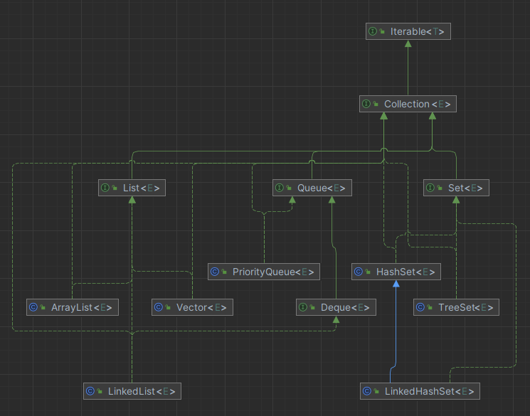
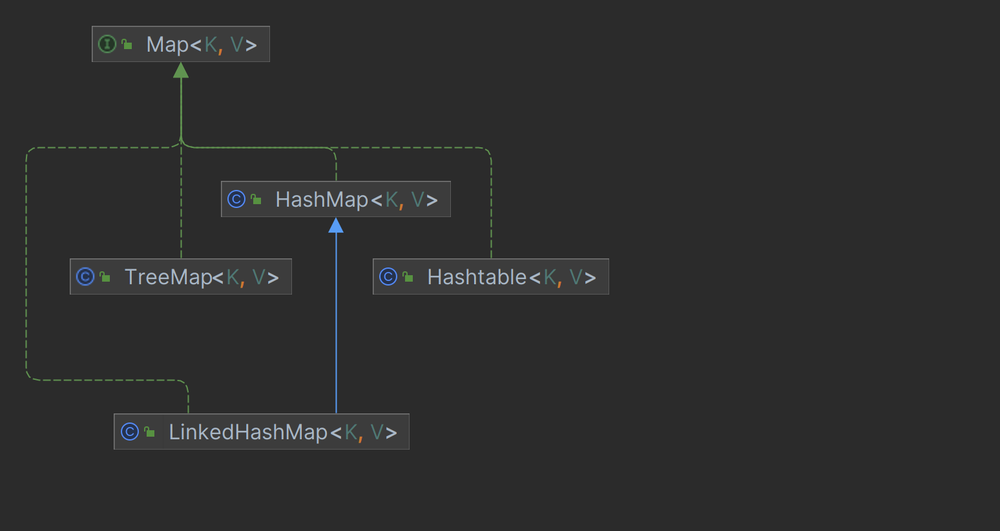

# 集合

## Collection

### List

- ArrayList
  - 基于动态数组实现
  - 支持随机访问 RandomAccess
- Vector
  - 和ArrayList一样 线程安全
- LinkedList
  - 基于双向链表实现

### Set

- HashSet
  - 基于哈希表实现  快速查找 无序的
- LinkedHashSet
  - 使用双向链表维护元素的插入顺序
- TreeSet
  - 基于红黑树 自然排序

### Queue

- Queue 单端队列
  - LinkedList
  - PriorityQueue 一个基于优先级**堆**的无界优先级队列，元素根据其自然顺序或者构造时指定的 `Comparator` 进行排序
- Deque 双端队列
  - LinkedList

## Map

- HashMap

  - 基于哈希表实现
- HashTable

  - 线程安全 使用 ConcurrentHashMap 来支持线程安全 ConcurrentHashMap 引入了分段锁
- LinkedHashMap

  - 维护着一个双向链表来记录插入顺序或访问顺序
- TreeMap

  - TreeMap 是基于红黑树的 NavigableMap 实现
